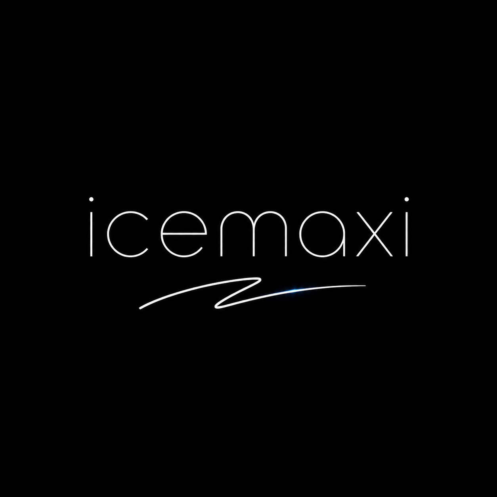

<table>
  <tr>
    <td width="34%" valign="middle">
      
    </td>
    <td width="66%" valign="middle">
      
ICEMAXI / 02

      <h1>fullstack with a colder edge.</h1>
      

        
      

      
I build small tools, sharp interfaces and the systems underneath them. Practical stack. Clean edges. No unnecessary noise.

      

        <a href="#now">now</a> | <a href="#fullstack-lane">lane</a> | <a href="#stack">stack</a> | <a href="#connect">connect</a>
      

    </td>
  </tr>
</table>

  

## now

<table>
  <tr>
    <td width="33%" valign="top">
      
01 / BUILD

      <strong>Make it useful.</strong> 
      Small tools that solve a real friction point.
    </td>
    <td width="33%" valign="top">
      
02 / LEARN

      <strong>Make it hold.</strong> 
      Fundamentals that survive outside the tutorial.
    </td>
    <td width="33%" valign="top">
      
03 / REFINE

      <strong>Make it feel finished.</strong> 
      Interfaces with restraint, rhythm and a blue edge.
    </td>
  </tr>
</table>

## fullstack lane

<table>
  <tr>
    <td width="42%" valign="middle">
      
SHIP SURFACE / 01 → 04

      <h3>Interface. API. Data. Infrastructure.</h3>
      
The interesting part is the handoff between layers: a clear surface, a reliable core and deployment that stays out of the way.

    </td>
    <td width="58%" valign="middle">
      
    </td>
  </tr>
</table>

## stack

CORE / FULLSTACK

  

TOOLBOX / IMPORTANT TOOLS

  
  
  
  
  
  
  
  
  

LANGUAGE RADAR / TOP 10

  
  
  
  
  
  
  
  
  
  

## connect

One profile. One clean starting point.

  

  

